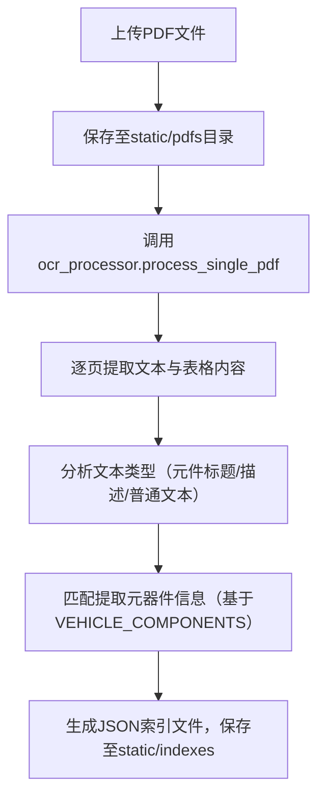
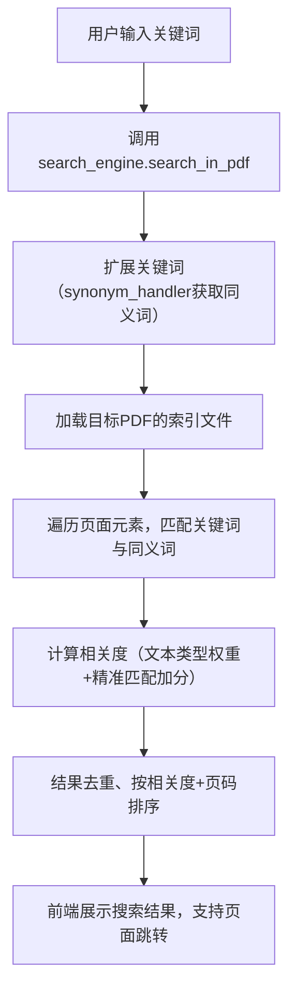

# 汽车电气系统PDF搜索系统

一款专注于汽车电气领域的PDF管理与搜索工具，支持PDF上传、自动元器件提取、精准关键词搜索，大幅提升电气原理图查阅效率。


## 一、产品介绍
### 1.1 核心功能
- **PDF全生命周期管理**：上传、查看、处理汽车电气相关PDF，实时展示文件大小、页数、元器件数量等关键信息。
- **自动化元器件提取**：上传后自动解析PDF文本与表格，识别电气元器件（如传感器、开关、继电器），生成结构化索引。
- **精准搜索与定位**：支持关键词搜索，结合领域同义词库（如“蓄电池电源”匹配“电瓶电源”），结果按相关度排序，点击可直达PDF对应页面。
- **可视化PDF预览**：内置PDF预览控件，支持翻页、缩放、搜索结果导航，无需依赖外部工具。

### 1.2 适用场景
- 汽车电气工程师查阅原理图、定位元器件位置
- 维修人员快速查找故障相关电气部件
- 汽车电气培训场景下的文档检索与教学


## 二、快速开始
### 2.1 环境依赖
- Python 3.8+
- 依赖库：
  ```bash
  pip install flask pdfplumber
  ```

### 2.2 部署步骤
1. **克隆代码**
   ```bash
   git clone <仓库地址>
   cd 汽车电气系统PDF搜索系统
   ```

2. **初始化目录**
   系统自动创建以下目录（无需手动操作）：
   - `static/pdfs`：存储上传的PDF文件
   - `static/indexes`：存储处理后生成的索引文件（JSON格式）
   - `logs`：存储系统运行日志

3. **启动服务**
   ```bash
   python app.py
   ```

4. **访问系统**
   浏览器打开 `http://localhost:5000` 即可进入系统首页。

### 2.3 使用流程
1. **上传PDF**：首页点击“上传并自动处理”，选择汽车电气相关PDF文件。
2. **查看状态**：在“已上传PDF列表”中查看文件处理进度（未处理/已处理/处理异常）。
3. **搜索元器件**：点击“查看与搜索”，输入关键词（如“ABS控制器”“轮速传感器”），查看匹配结果并跳转至PDF对应页面。


## 三、项目架构
### 3.1 架构分层
| 层级       | 核心文件/组件                | 功能描述                                                                 |
|------------|------------------------------|--------------------------------------------------------------------------|
| 前端层     | `index.html`、`view_pdf.html` | 提供用户交互界面，包括文件列表、上传表单、搜索结果展示、PDF预览与控制     |
| 后端层     | `app.py`（Flask应用）         | 处理HTTP请求，提供路由（上传、处理、搜索、预览）、业务逻辑调度             |
| 服务层     | `ocr_processor.py`           | PDF文本提取、表格解析、元器件识别、索引生成                               |
|            | `search_engine.py`           | 关键词搜索、同义词匹配、结果排序与去重                                   |
| 数据层     | `static/pdfs`、`static/indexes` | 存储原始PDF文件与结构化索引（JSON）                                       |
| 配置层     | `config.py`                  | 系统配置（目录路径、日志配置）                                           |
|            | `synonym_handler.py`         | 汽车电气领域同义词库管理与匹配                                           |

### 3.2 核心业务流程
#### 3.2.1 PDF处理流程


#### 3.2.2 搜索流程



## 四、技术选型
| 技术类别   | 选型          | 选型理由                                                                 |
|------------|---------------|--------------------------------------------------------------------------|
| 后端框架   | Flask         | 轻量级Python Web框架，路由灵活，开发效率高，适合中小型工具类应用           |
| PDF处理    | pdfplumber    | 高精度提取PDF文本与表格，保留格式信息，优于PyPDF2，适配电气原理图分析场景 |
| 前端技术   | HTML+CSS+JS   | 原生技术栈，降低复杂度，通过JS实现PDF预览控制与搜索交互                   |
| 图标与样式 | Font Awesome  | 提供丰富工业风图标，提升页面视觉体验，支持响应式设计                     |
| 数据存储   | 本地文件系统  | 索引用JSON存储，无需数据库依赖，部署简单，满足中小规模PDF管理需求         |
| 日志处理   | Python logging| 原生模块，支持文件+控制台双输出，便于问题排查与系统监控                   |


## 五、关键技术决策
### 5.1 PDF处理：优先文本提取而非OCR
- **决策依据**：汽车电气原理图PDF多为“可复制文本型”（非扫描件），pdfplumber可直接提取文本，精度达95%+，速度比OCR快3-5倍。
- **优势**：避免OCR识别误差，降低性能开销，满足实时处理需求。

### 5.2 搜索优化：分层相关度评分
- **评分规则**：
  - 元件标题（如“ABS控制器”）：3分（最高优先级）
  - 元件描述/表格（如“ABS控制器连接方式”）：2分
  - 普通文本：1分
  - 精准匹配元器件名称：额外加1.5倍权重
- **优势**：确保核心信息优先展示，减少无效搜索结果。

### 5.3 数据存储：JSON索引替代数据库
- **决策依据**：索引数据结构简单（页码、文本、元器件列表），JSON可直接映射为Python字典，读写速度快。
- **优势**：无需部署MySQL/Redis，降低系统复杂度，单个索引文件<100KB，加载效率高。


## 六、扩展建议
1. **功能扩展**：
   - 新增“元器件分类统计”，展示PDF内传感器、开关、继电器等类型分布。
   - 支持批量上传与批量处理，提升多文件管理效率。

2. **性能优化**：
   - 大文件（100页+）采用Celery异步处理，避免前端等待。
   - 新增Redis缓存索引，减少重复加载开销。

3. **兼容性扩展**：
   - 集成Tesseract OCR，支持扫描件PDF处理，覆盖更多场景。
   - 适配移动端，优化小屏设备上的PDF预览与搜索交互。


## 七、目录结构
```
汽车电气系统PDF搜索系统/
├── app.py                # 后端入口，Flask路由与业务调度
├── config.py             # 系统配置（目录路径、日志配置）
├── ocr_processor.py      # PDF处理与元器件提取核心逻辑
├── search_engine.py      # 搜索引擎与结果排序
├── synonym_handler.py    # 领域同义词处理
├── special_circuit_data.py # 特定电路数据（可自定义）
├── static/
│   ├── pdfs/             # 存储上传的PDF文件
│   └── indexes/          # 存储生成的JSON索引文件
├── logs/                 # 系统日志文件
├── templates/
│   ├── index.html        # 首页（文件列表与上传）
│   └── view_pdf.html     # PDF查看与搜索页面
└── README.md             # 项目说明文档
```
